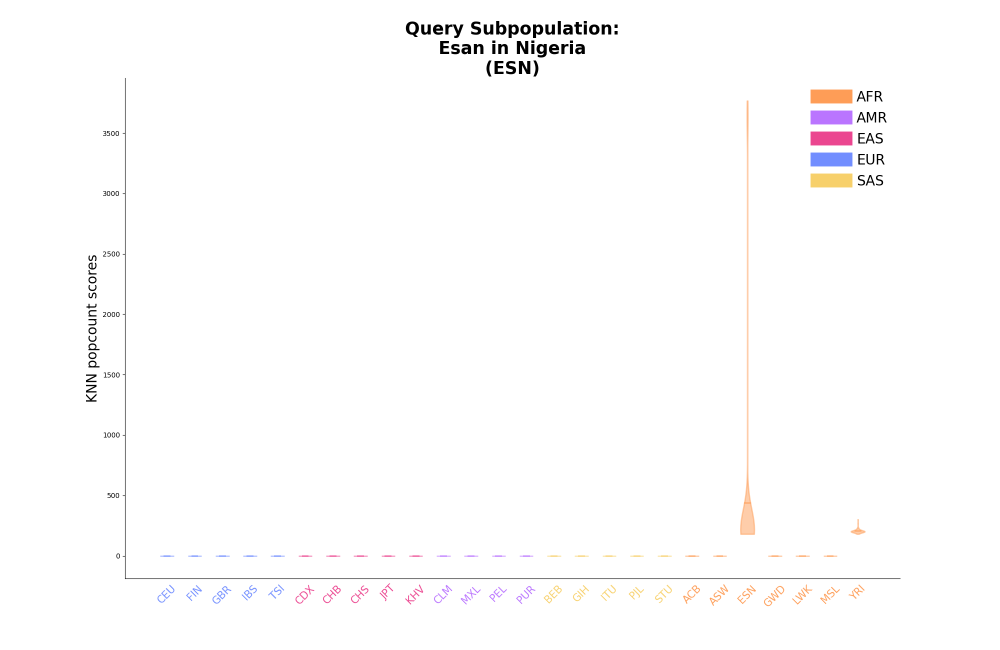

# biobagg_analysis

## Generate violin plots for 1K subpopulation data

Arguments:
- population.txt: file with 1KG population information
- top_hits.txt: file with KNN hits (formatted with Ryan's aggregation)
- sub_population_violin: directory for png files

Example Run:
```
python plotting/evaluate_ancestry.py \
  --pop population.txt \
  --knn top_hits.txt \
  --png population_violin_plots
```

<details>
<summary>Example PNGs:</summary>
  
<br>
<br>
<br>
<br>
<br>

</details>

## Generate search time plot for 1K

Arguments:
- search.log: contains the timing in seconds for each segment query, which includes all samples 
- 3202: the number of samples, so we can get a per sample time

Example Run:
```
python plotting/search_time.py 
  --num_samples 3202 
  --in_file data/search.log \
  --out_file time_plots/1kg_search_time_histo.png \
  --height 4 \
  --width 8
per sample per segment median (ms) 1.6923797626483446
per sample per segment mean (ms) 1.7311439951686394
per sample per segment stdev (ms) 0.2026710271379037
per sample mean run time (s) 6.0624662710805755
```
<details>
<summary>Example PNG:</summary>


</details>

## Look at the distribution of SVS scores

Arguments:
- chrm15-20.scores.gz: a comppress files where each line is a segment and all the top scores found for that segment

To get the scores file we condense scores to just one with:
```
for f in $( ls svs_results_chrm15-20/chrm*knn); do
    scores=$(cat $f | grep "_" | grep -v Query | cut -f2 | paste -sd " " -)
    echo -e "$f\t$scores"
done
```

Example Run:
```
python plotting/svs_scores.py \
    --in_file data/svs_results_chrm15-20.scores.gz \
    --out_file doc/svs_results_chrm15-20.scores.png \
    --height 8 \
    --width 5
15 [(15, 116, 3.836806668951722), (15, 28, 3.858078428857078), (15, 18, 11.544884247367353), (15, 39, 21.053507923862096), (15, 38, 47.9898720677839)]
16 [(16, 12, 3.1613097526350127), (16, 44, 3.5656954299731387), (16, 74, 4.133413055066931), (16, 2, 4.20666641220193), (16, 121, 9.45365259706147)]
17 [(17, 113, 2.926318128540011), (17, 2, 3.043968168123173), (17, 120, 3.1055936278300367), (17, 84, 3.1133913746537143), (17, 121, 4.326603849286288)]
18 [(18, 21, 3.0060410454243276), (18, 28, 3.060823315008067), (18, 30, 3.4353850232836374), (18, 9, 3.5373145689126986), (18, 102, 4.424481229262819)]
19 [(19, 1, 3.265355917200741), (19, 93, 3.4199648634766127), (19, 83, 3.6791844582441913), (19, 85, 5.445205323261027), (19, 2, 6.075723558402503)]
20 [(20, 2, 3.065332156191743), (20, 3, 5.15034327873235), (20, 89, 5.2502671985309455), (20, 94, 6.143665913587223), (20, 108, 6.660910728333406)]
```

<details>
<summary>Example PNG:</summary>


</details>


