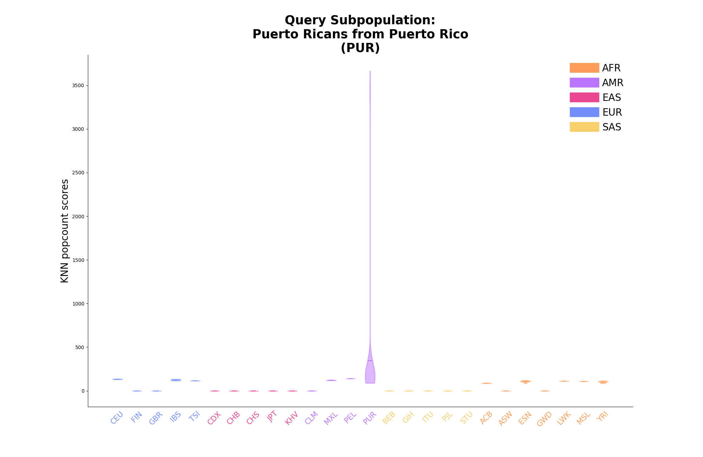
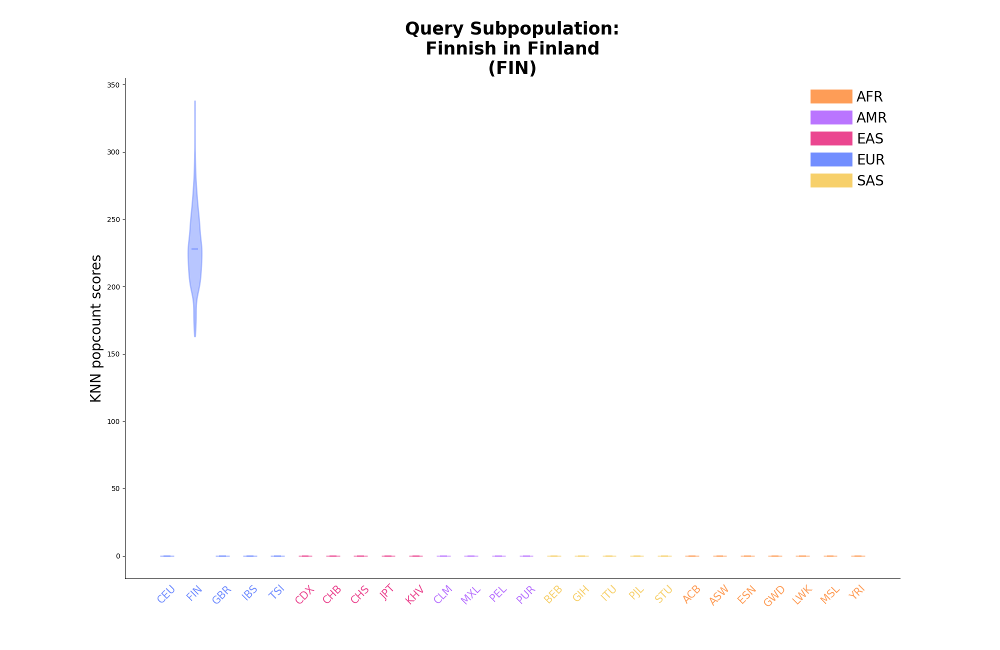
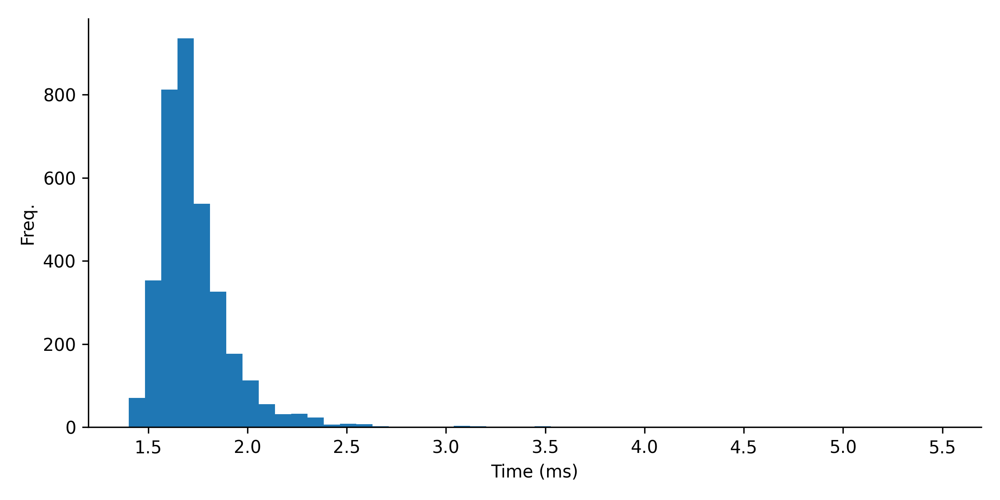

# biobagg_analysis

## Generate violin plots for 1K subpopulation data

Arguments:
- population.txt: file with 1KG population information
- top_hits.txt: file with KNN hits (formatted with Ryan's aggregation)
- sub_population_violin: directory for png files

Example Run:
```
python plotting/evaluate_ancestry.py \
  --pop population.txt \
  --knn top_hits.txt \
  --png population_violin_plots
```

<details>
<summary>Example PNGs:</summary>
  
<br>
<br>
<br>
<br>
<br>

</details>

## Generate search time plot for 1K

Arguments:
- search.log: contains the timing in seconds for each segment query, which includes all samples 
- 3202: the number of samples, so we can get a per sample time

Example Run:
```
python plotting/search_time.py 
  --num_samples 3202 
  --in_file data/search.log \
  --out_file time_plots/1kg_search_time_histo.png \
  --height 4 \
  --width 8
per sample per segment median (ms) 1.6923797626483446
per sample per segment mean (ms) 1.7311439951686394
per sample per segment stdev (ms) 0.2026710271379037
per sample mean run time (s) 6.0624662710805755
```
<details>
<summary>Example PNG:</summary>



</details>
