## Publication Figures

### Figure 2: Family Data
```
python plotting/figure2_related.py \
    --colors pub_figures/colors.txt \
    --decode_genosis data/decode/decode_POP.txt \
    --decode_ibd data/decode/decode_IBD.txt \
    --AFR_genosis data/1kg_trio_data/GenoSiS_AFR_trio_scores_20.txt \
    --AMR_genosis data/1kg_trio_data/GenoSiS_AMR_trio_scores_20.txt \
    --EAS_genosis data/1kg_trio_data/GenoSiS_EAS_trio_scores_20.txt \
    --EUR_genosis data/1kg_trio_data/GenoSiS_EUR_trio_scores_20.txt \
    --SAS_genosis data/1kg_trio_data/GenoSiS_SAS_trio_scores_20.txt \
    --AFR_dst data/1kg_trio_data/plink_dst_AFR_trio_scores_20.txt \
    --AMR_dst data/1kg_trio_data/plink_dst_AMR_trio_scores_20.txt \
    --EAS_dst data/1kg_trio_data/plink_dst_EAS_trio_scores_20.txt \
    --EUR_dst data/1kg_trio_data/plink_dst_EUR_trio_scores_20.txt \
    --SAS_dst data/1kg_trio_data/plink_dst_SAS_trio_scores_20.txt \
    --AFR_pihat data/1kg_trio_data/plink_pihat_AFR_trio_scores_20.txt \
    --AMR_pihat data/1kg_trio_data/plink_pihat_AMR_trio_scores_20.txt \
    --EAS_pihat data/1kg_trio_data/plink_pihat_EAS_trio_scores_20.txt \
    --EUR_pihat data/1kg_trio_data/plink_pihat_EUR_trio_scores_20.txt \
    --SAS_pihat data/1kg_trio_data/plink_pihat_SAS_trio_scores_20.txt \
    --AFR_kin data/1kg_trio_data/plink_kin_AFR_trio_scores_20.txt \
    --AMR_kin data/1kg_trio_data/plink_kin_AMR_trio_scores_20.txt \
    --EAS_kin data/1kg_trio_data/plink_kin_EAS_trio_scores_20.txt \
    --EUR_kin data/1kg_trio_data/plink_kin_EUR_trio_scores_20.txt \
    --SAS_kin data/1kg_trio_data/plink_kin_SAS_trio_scores_20.txt \
    --png pub_figures/figure2_family.png
```
<Figure>
  
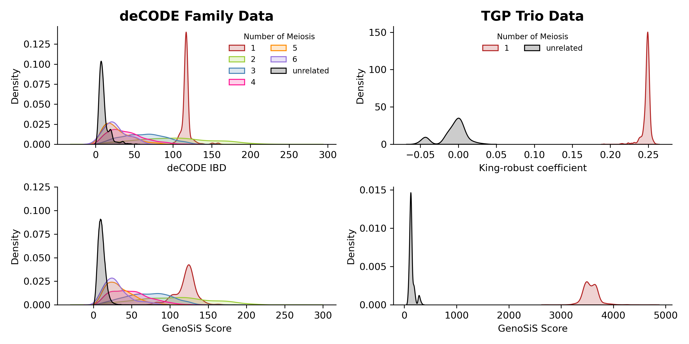<br>
*Figure 2. Genetic distance distributions among closely related samples. A deCODE IBD and B GenoSiS score distributions for deCODE families. C King-robust coefficient and D GenoSiS score distributions for TGP trios. The deCODE IDB and GenoSiS score ranges correspond to the number of cMs considered while the King-robust coefficient is normalized such that first-degree relatives have a score ~0.25, second-degree relatives ~0.125, and so forth.  AB considered two haplotypes for chromosome 18. CD considered all autosomes. Distributions plotted and colored by numbers of meiotic events separating two samples where the number of meiotic events corresponds to family relationships (e.g. 1 = parent/child, 2 = grandparent/grandchild, full-siblings, etc.). All cohorts were size 20.* 
</Figure>


### Figure 3: TGP Data
#### Figure 3A & Supplementary Figure S1,AB: Decay plots
```
python plotting/figure3_ancestry.py \
    --ancestry data/1kg_info/1kg_ancestry.tsv \
    --k 20 \
    --colors pub_figures/colors.txt \
    --genosis_groups data/1kg_pop_hits.txt \
    --genosis_k data/1kg_top_hits/TOP_HITS_20.txt \
    --dst_groups data/1kg_plink_topK/plink_DST_20_groups.txt \
    --pihat_groups data/1kg_plink_topK/plink_pihat_20_groups.txt \
    --kinship_groups data/1kg_plink_topK/plink_kin_20_groups.txt \
    --dst_k data/1kg_plink_topK/plink_DST_top_20.txt \
    --pihat_k data/1kg_plink_topK/plink_pihat_top_20.txt \
    --kinship_k data/1kg_plink_topK/plink_kin_top_20.txt \
    --png_dist pub_figures/figure3_distribution.png \
    --png_k pub_figures/figure3_topk.png
```
<Figure>

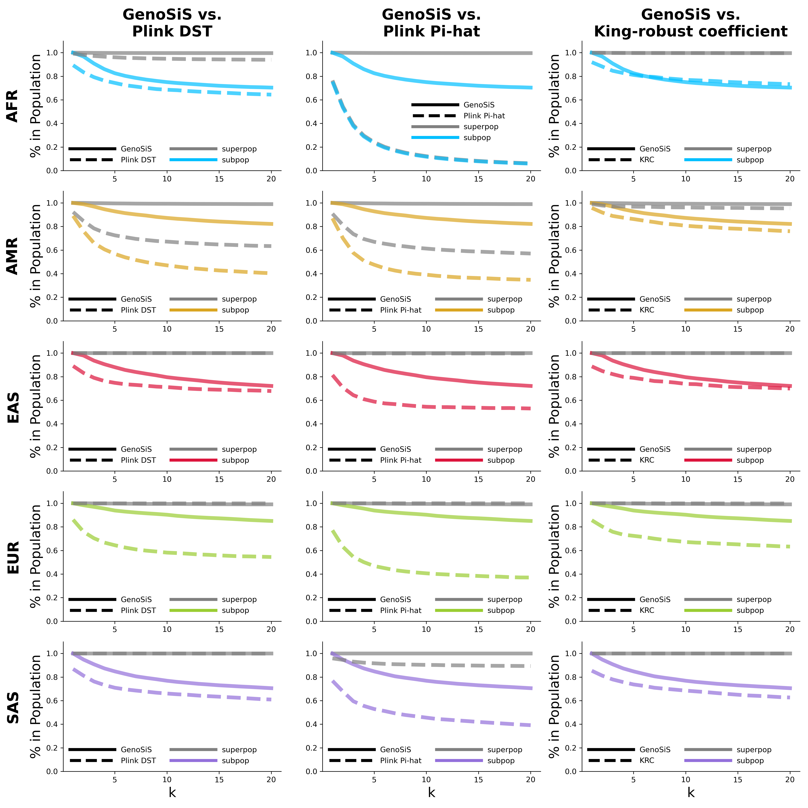<br>
*Figure 3A. Percentage of samples from the TGP cohorts which are in the super and subpopulation of the query samples as the size of the cohorts increase from 1 to 20. GenoSiS is plotted as a solid line while the King-robust coefficient is plotted as a dashed line. Lines for super populations are plotted in gray, while lines for subpopulation are plotted in a color corresponding to the population.*
</Figure>

#### Figure 3BC & Supplementary Figure S1,CD: Decay plots: Subpopulation heatmaps
```
python plotting/figure_sup_subpops.py \
    --ancestry data/1kg_info/1kg_ancestry.tsv \
    --k 20 \
    --colors pub_figures/colors.txt \
    --genosis data/subpop_counts/genosis_counts.tsv \
    --dst data/subpop_counts/dst_counts.tsv \
    --pihat data/subpop_counts/pihat_counts.tsv \
    --kin data/subpop_counts/kinship_counts.tsv \
    --png pub_figures/
```
<Figure>

|                                                           |                                                            |
|-----------------------------------------------------------|------------------------------------------------------------|
|  | 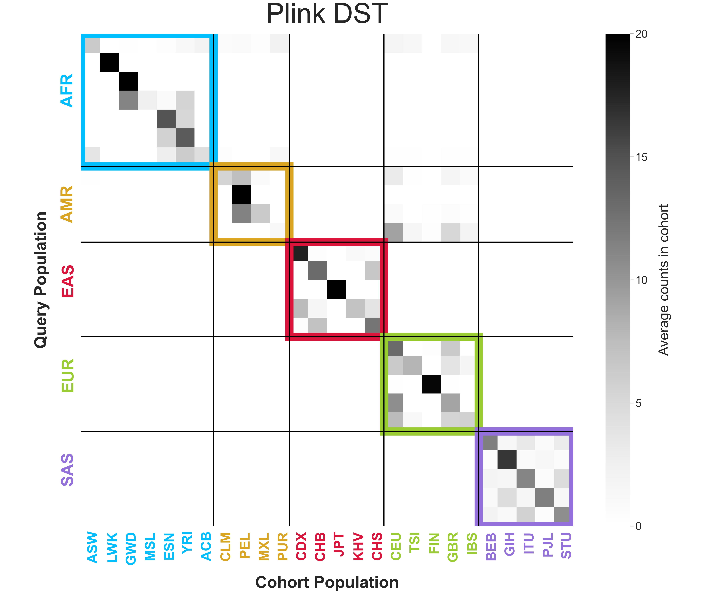          |
|     | 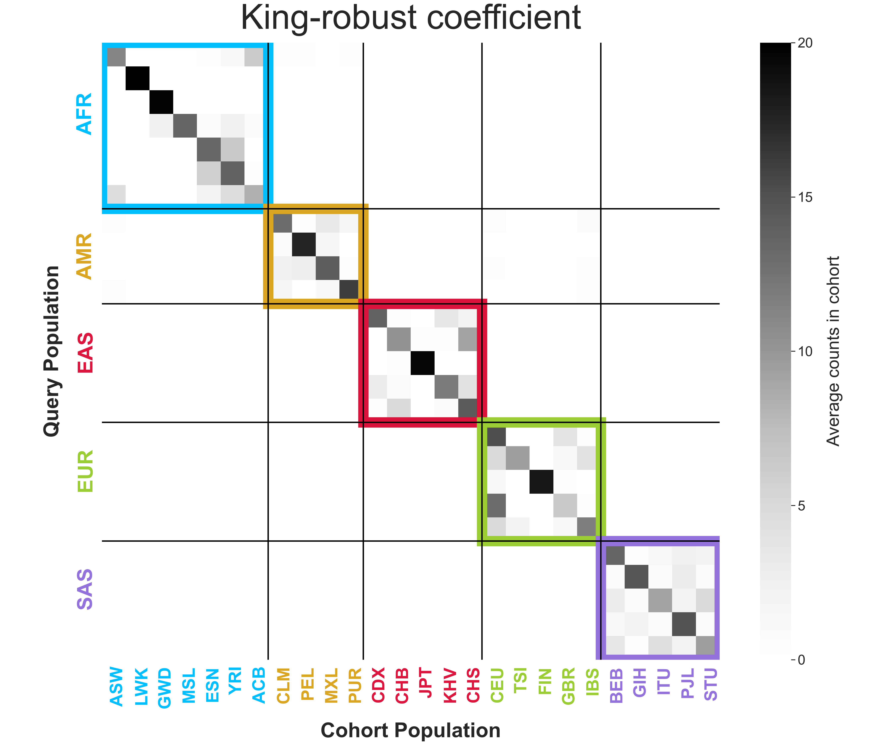  |

*Figure 3BC. Average subpopulation counts of appearances in cohorts generated by GenoSiS, Plink DST, Plink Pi-hat, and King-robust coefficient. Super population labels for query samples are listed on the vertical axis and are colored accordingly. Subpopulation labels for samples in the representative cohort are listed on the horizontal axis and are colored according to their respective super population. FST is a statistical measure of genetic differentiation between populations.*
</Figure>

#### Figure 3DE: FST
```
python plotting/plot_subpop_fst.py \
    --output pub_figures/subpop_fst.png \
    --input data/genosis.fst.txt data/kinship.fst.txt data/dst.fst.txt data/pihat.fst.txt \
    --labels GenoSiS King-robust DST Pi-Hat \
    --height 4 \
    --width 9 
```
<Figure>

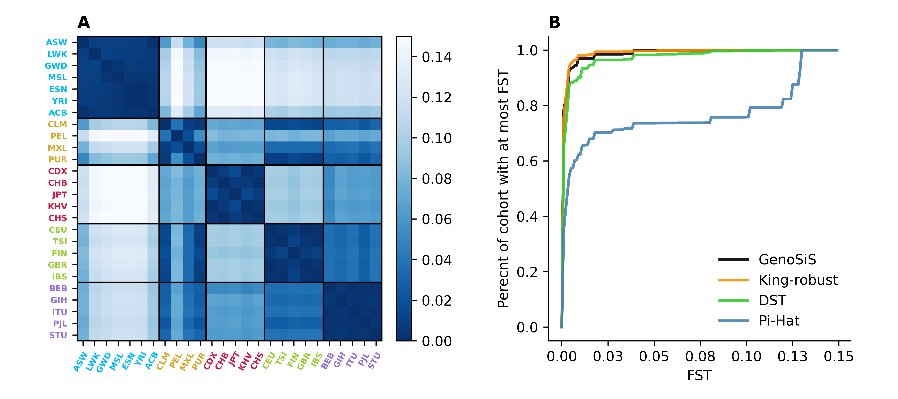
*Figure3DE. D Empirical distribution function tracking the percentage of samples identified by 3 comparison methods that were from subpopulations with an FST value less than equal to than a specified threshold. For instance, 78% of samples identified by GenoSiS were from populations with an FST ≤ 0.001, King-robust had 75.2%, DST had 64.8%, and pi-Hat had 34.6%.  A lower FST and darker blue color indicates higher genetic similarity. E FST for all TGP subpopulations grouped by super population. Cohort size k = 20 for all scenarios.*
</Figure>

### Figure 4: CCPM Data
#### Figure 4A: CCPM Cohorts
```
python plotting/plot_ccpm.py \
    --ancestry data/ccpm_data/R168_ccpm_f3_PCs_genetic_similarity_19Jun2024.txt
    --ancestry_dir data/ccpm_data/ccpm_results/
    --png pub_figures/ccpm_ancestry.png
```
<Figure>

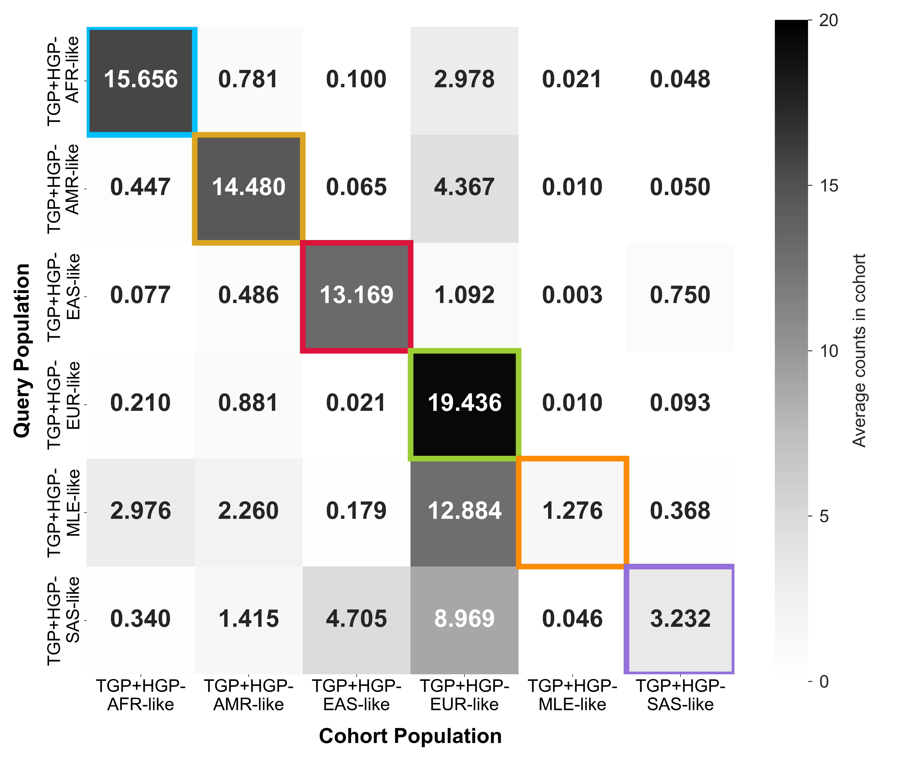
*Figure4A. Average CCPM group counts for cohorts generated by GenoSiS plotted as a heatmap. Group labels for the query samples are listed on the left axis, while the labels of sample which appear in their GenoSiS cohort appear on the bottom axis.*
</Figure>

#### Figure 4B: CCPM FST

```
python plottying/plot_ccpm_fst.py \    
    --ccpm_fst data/ccpm_data/plink_fst_my_fst.txt.fst.summary
    --out_dir pub_figures/
```
<Figure>

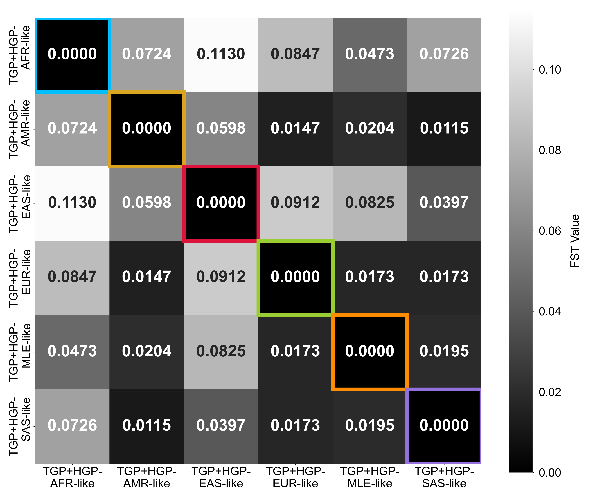
*Figure4B. CCPM FST by population.*
</Figure>


#### Figure 4C: CCPM timing
```
python plottying/plot_timing.py \    
    --times data/ccpm_times/
    --out pub_figures/
```
<Figure>


*FIgure 4C. GenoSiS search and aggregation times for CCPM’s 73,346 biobank samples.*
</Figure>

### Figure 5: Cohort Quality on TGP
```
python plotting/figure5_quality.py \
    --ancestry data/1kg_info/1kg_ancestry.tsv \
    --k 20 \
    --colors pub_figures/colors.txt \
    --quality_dir data/quality_data/ \
    --png_hist pub_figures/figure5_
```
<Figure>
  
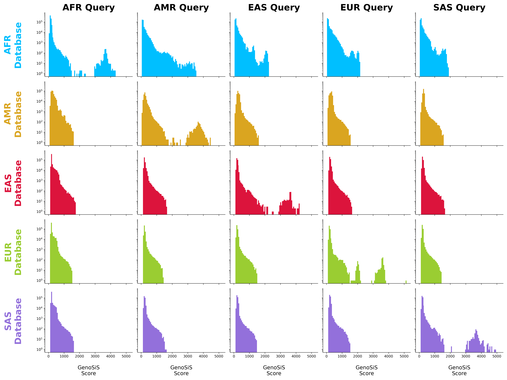<br>
*Figure5. Rows are representative and colored by the population of the database (i.e. samples which can appear in the GenoSiS cohort), columns are representative of the query population. In cases where the query and database sets were from the same super population (diagonal) we separately label when the cohort samples matched the query samples’ sub and super population labels.*
</Figure>

### Figure 6: Embedding quality by segment density
```
python plotting/plot_density.py \
    --ancestry_file data/1kg_info/1kg_ancestry.tsv" \
    --density_dir data/density_1kg/" \
    --distance_dir data/distance_1kg/" \
    --colors pub_figures/colors.txt" \
    --out pub_figures/ \
```
<Figure>

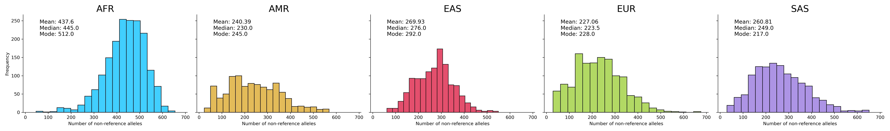

*Figure 6. Embedding quality is worse for individuals with more non-reference alleles, who most often have African genetic ancestry. (TOP) The distribution of non-reference allele counts by population. (BOTTOM) The relationship between a sample’s embedding quality, measured by the correlation coefficient (R²) between the genotype encoding and embedding distances, and the number of non-reference alleles in the sample’s genome.*
</Figure>

### SUPPLEMENTAL (not included above)

#### GenoSiS scores for TGP
```
(same script used to generate Figure 3)

python plotting/figure_sup_subpops.py \
    --ancestry data/1kg_info/1kg_ancestry.tsv \
    --k 20 \
    --colors pub_figures/colors.txt \
    --genosis data/subpop_counts/genosis_counts.tsv \
    --dst data/subpop_counts/dst_counts.tsv \
    --pihat data/subpop_counts/pihat_counts.tsv \
    --kin data/subpop_counts/kinship_counts.tsv \
    --png pub_figures/
```

<Figure>

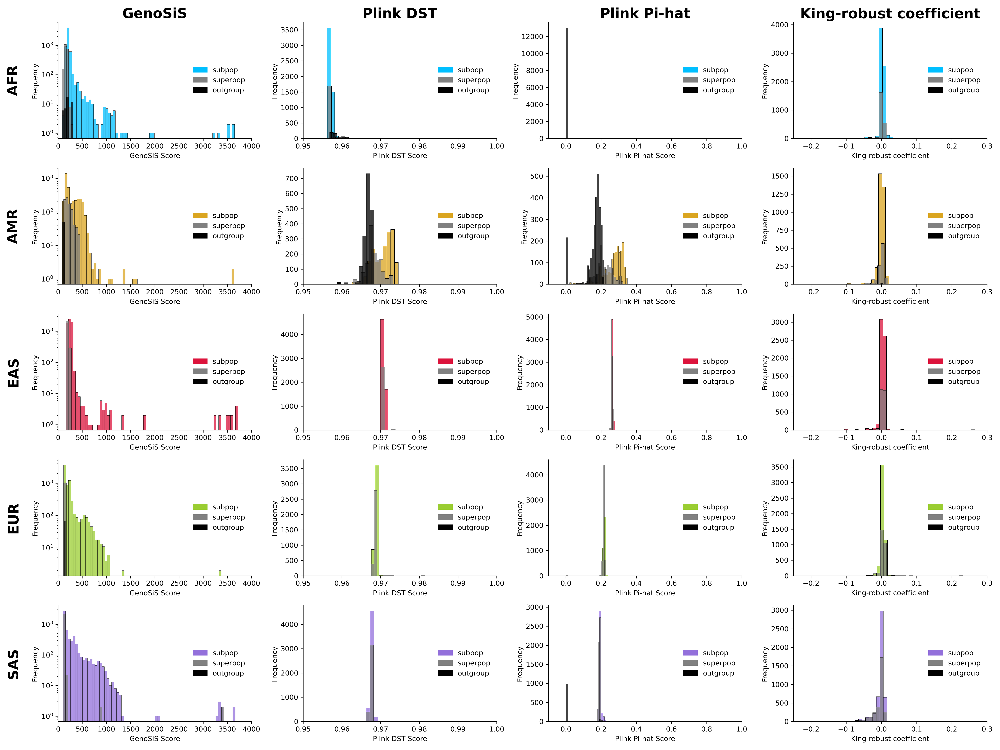<br>
*Figure S2. TGP cohort scores by population. Histograms of GenoSiS, plink DST, plink pi-hat, and King robust coefficient cohort scores for TGP data for k=20. TGP super populations are organized by row. Samples in the cohort which appear in the same subpopulation as the query sample are colored in yellow, red, green, blue, and purple for AFR, AMR, EAS, and SAS query samples accordingly. Samples in the cohort which appear in the same super population as the query sample are colored in gray. Samples in the cohort which appear outside of the query’s super population are colored in black.*
</Figure>


#### GenoSiS scores for CCPM

```
(same script used to generate Figure 3)

python plotting/figure_sup_subpops.py \
    --ancestry data/1kg_info/1kg_ancestry.tsv \
    --k 20 \
    --colors pub_figures/colors.txt \
    --genosis data/subpop_counts/genosis_counts.tsv \
    --dst data/subpop_counts/dst_counts.tsv \
    --pihat data/subpop_counts/pihat_counts.tsv \
    --kin data/subpop_counts/kinship_counts.tsv \
    --png pub_figures/
```

<Figure>

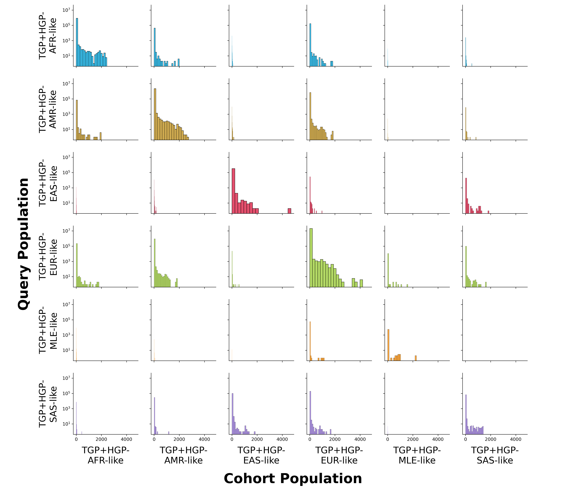<br>
*Figure S3. CCPM Biobank cohort scores by population. Histograms of GenoSiS cohort scores when k=20 for CCPM Biobank data. Query and cohort population labels are plotted in the same order for both axes.*
</Figure>
